# CrowdQR Architecture Documentation

## System Architecture Overview

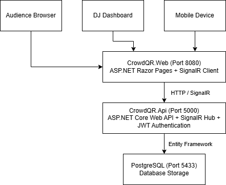

## User Workflow

### DJ Workflow

DJ Registration & Setup:

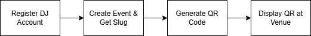

Live Event Management:

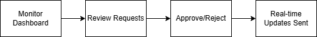

### Audience Workflow

Audience Participation:

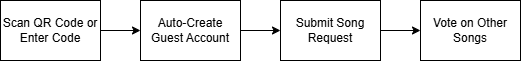

Real-time Experience:

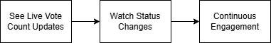

## Data Flow Architecture

Audience Request Submission:

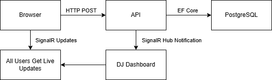

DJ Approval Process:

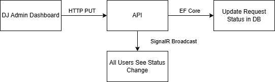

## Component Interaction

SignalR Real-time Communication:

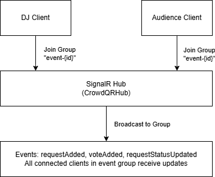

## Security Architecture

Authentication & Authorization Flow:

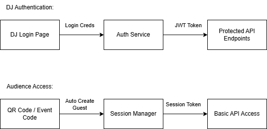

## Database Schema Overview

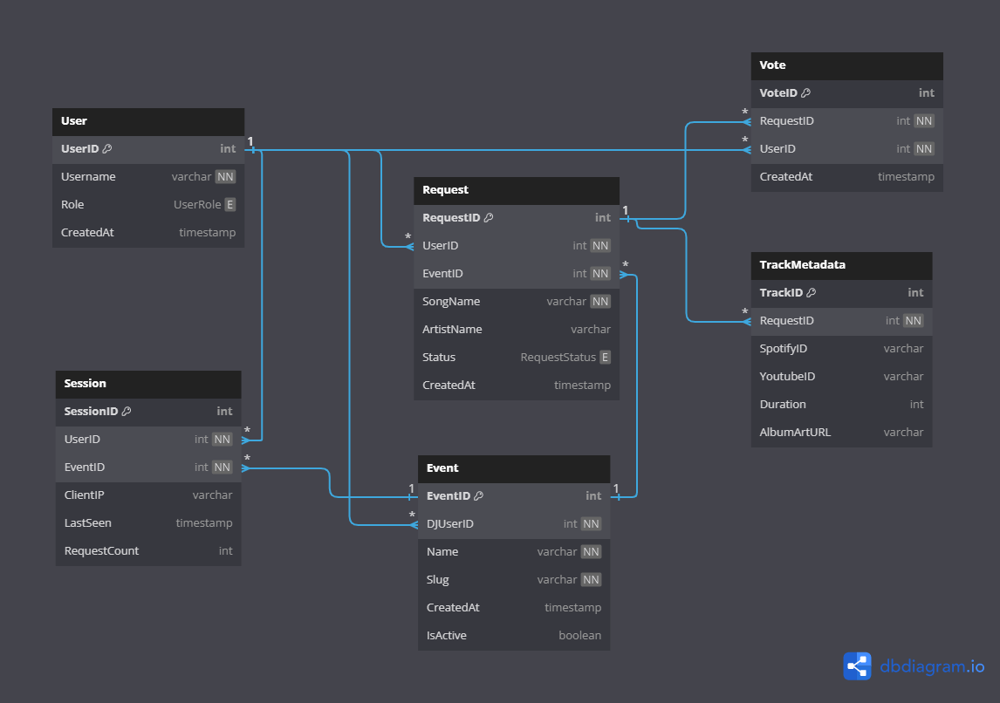

## Deployment Architecture

Container Deployment:

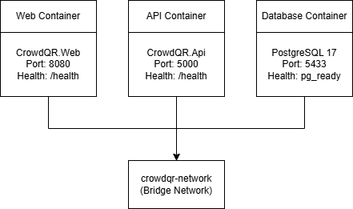

For implementation details, see:

- [API Documentation](../src/CrowdQR.Api/)
- [Web Application](../src/CrowdQR.Web/)  
- [Deployment Guide](../deploy/README.md)